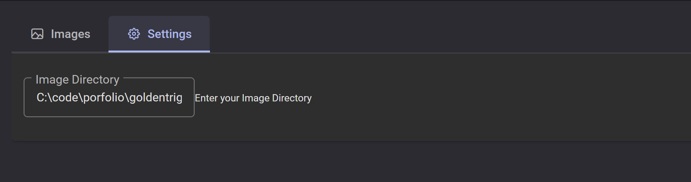

# Image Data Set Viewer

This is a TypeScript project that allows you to view and browse through a directory of images. The application consists of a NestJS server and a NestJS client.
Screenshots

Image 1: Image Viewer Interface

Image 2: Image Directory Setting

To run the Image Data Set Viewer, follow these steps:

    Clone the repository to your local machine.
    Open a terminal and navigate to the project directory.
    Run npm install to install all the required dependencies.
    After installation is complete, execute the run_apps.bat file to start both the NestJS server and the NestJS client.
    Once the applications are running, open your web browser and visit http://localhost:4200 to access the Image Viewer interface.

Note: Since this is a TypeScript project, you will need to have Node.js and npm (Node Package Manager) installed on your machine to run the application.
Usage

    In the Image Viewer interface, you will see a grid of images from the default directory (C:\code\portfolio\goldentrig).
    To change the image directory, click on the "Settings" tab and enter the desired directory path in the "Image Directory" field.
    Use the pagination controls at the top to navigate through the image set.
